# Wall Flip

A digital watchface for Pebble smartwatches based on flip clock design.

## Screenshots
### Pebble Classic/Steel
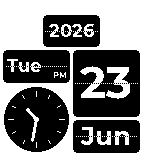
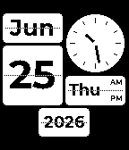
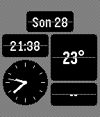
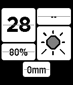

### Pebble 2/Duo
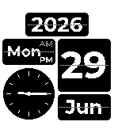

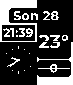
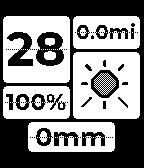

### Pebble Time/Time Steel
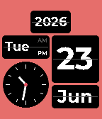

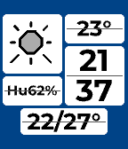
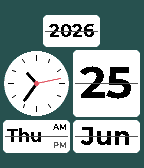
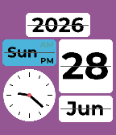

### Pebble Time Round
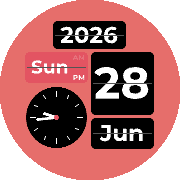
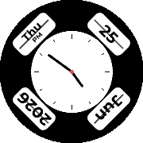
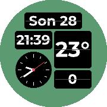
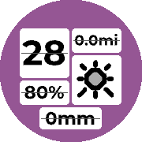

### Pebble Time 2
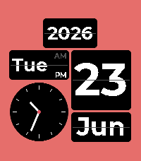

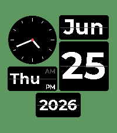
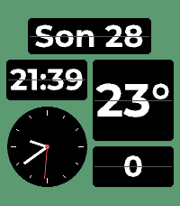
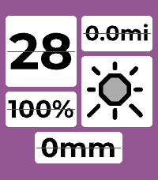

### Pebble Time Round 2
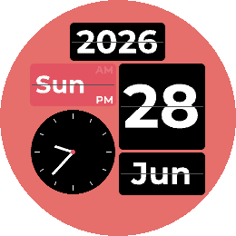
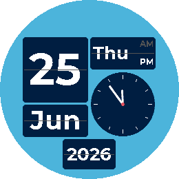
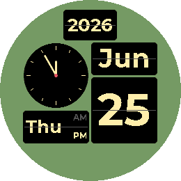
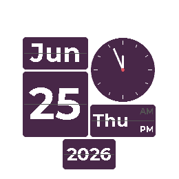

## Store
[Rebble App Store](https://apps.rebble.io/en_US/application/6a3d4248cd52370009862b05)
[Pebble App Store](https://apps.repebble.com/6a3d4248cd52370009862b05)

## Configuration options

Configure via the Pebble app settings page.

### General
- **Language** — translates month and weekday names. 10 Latin-script languages: English, Espanol, Portugues, Francais, Deutsch, Italiano, Nederlands, Polski, Turkce, Indonesia.
- **Units** — Metric (°C, mm) or Imperial (°F, in). Applies to the weather blocks.
- **Show seconds hand** — adds a seconds hand to the analog clock block (off by default to save battery).
- **Flip animation** — blocks flip like a split-flap when their value changes (on by default).
- **Seam line** — thin line across each block's middle for the flip-display look (on by default).

### Layout
Each grid quadrant and the banner is assigned a block. Blocks come in two sizes — **big** (Day of month, Analog clock, Digital clock, Weather icon, Temperature) and **small** (everything else). Each column pairs one big block with one small block; picking two of the same size auto-swaps the other.

- **Banner block** — full-width banner content: Year, Digital clock, Month + Day, Weekday + Day, Steps, Distance, Battery, Temperature, Humidity, Min/Max temp, or Precipitation.
- **Banner at top** — banner above the grid (on) or below it (off).
- **Top-left / Top-right / Bottom-left / Bottom-right block** — fill each quadrant with:
  - **Date/time:** Day of week, Day of month, Analog clock, Digital clock (big or small), Month
  - **Activity:** Steps, Distance, Battery
  - **Weather:** Weather icon, Temperature (big or small), Humidity, Precipitation

### Weather
Weather blocks (icon, temperature, humidity, precipitation, min/max) pull current conditions from Open-Meteo using the phone's location. The icon maps WMO weather codes to condition glyphs. Values render in the selected unit system.

### Colors
- **Face background** — color behind the panels.
- **Panel background** — color of the flip panels.
- **Weekend / accent** — day-of-week panel color on weekends, also used for the inactive AM/PM label.

Text color is automatic: black on light backgrounds, white on dark ones.

## Support
For issues, questions, or suggestions, please open an issue on GitHub.

## License
MIT License - feel free to modify and share!