# Wall Flip

A digital watchface for Pebble smartwatches based on flip clock design.

## Screenshots
### Pebble Classic/Steel
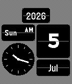
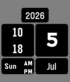
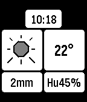
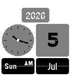

### Pebble 2/Duo
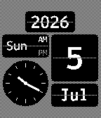
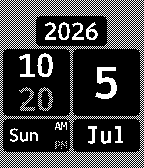
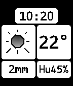
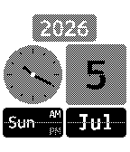

### Pebble Time/Time Steel

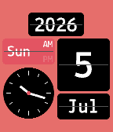
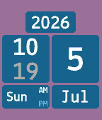
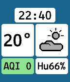
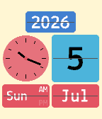

### Pebble Time Round
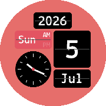
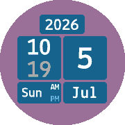
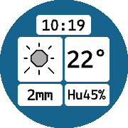
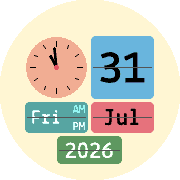

### Pebble Time 2
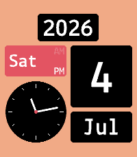

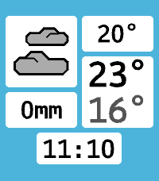
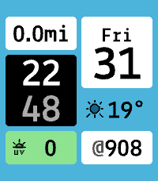
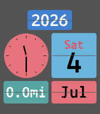

### Pebble Time Round 2
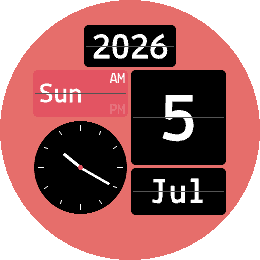
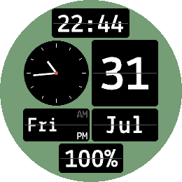
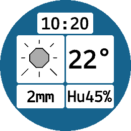
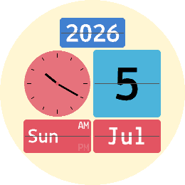

## Store
[Rebble App Store](https://apps.rebble.io/en_US/application/6a3d4248cd52370009862b05)
[Pebble App Store](https://apps.repebble.com/6a3d4248cd52370009862b05)

## Configuration options

Configure via the Pebble app settings page. Settings, colors, presets and share codes come first; the face itself sits at the bottom, as a live preview that doubles as the editor. **Tap a block on the preview** and a palette opens right under it holding every block that slot can take, big and small, each drawn as a miniature of itself. Tap one to place it, or tap the face again to close.

**Selected Block**, below the palette, holds what that one block can be tuned to: its panel color, and — for the blocks that have a choice — a select for the detail that separates two otherwise identical blocks:

| Block | Choice |
|---|---|
| Digital clock (big or small) | Leading zero shown or hidden |
| Temperature (small) | Weather icon shown or hidden |
| Calendar (big) | Second line reads the weekday or the month |
| AM/PM (small) | Side by side or stacked diagonally |
| UV index, Air quality (big or small) | Band color off, or the panel painted in the reading's own band color |

Those variations are listed once in the palette and swapped from the select, so the palette stays a list of *what* a block shows rather than every spelling of it.

### General
- **Language** — translates month and weekday names. 10 Latin-script languages: English, Espanol, Portugues, Francais, Deutsch, Italiano, Nederlands, Polski, Turkce, Indonesia.
- **Units** — Metric (°C, mm) or Imperial (°F, in). Applies to the weather blocks.
- **Show seconds hand** — adds a seconds hand to the analog clock block (off by default to save battery).
- **Flip animation** — blocks flip like a split-flap when their value changes (on by default).
- **Seam line** — thin line across each block's middle for the flip-display look (on by default).

### Layout
Both faces are two columns. Blocks come in two sizes — **big** (fills a square quadrant) and **small** (half height) — and every column holds exactly one big block, the rest small; picking a second big one auto-swaps the other. The **Layout** setting picks the face:

- **Classic (5 blocks)** — a banner sized to its text, above or below the two columns.
- **Columns (6 blocks)** — no banner. Each column gets a third block in its middle, so it runs one big block plus two small ones, with the big one in any of the three slots. Round screens can't take a full-height column, so there the two middles lift out into small strips above and below the grid, which keeps the circular shape — and, being strips, those two are always small.

- **Banner block** — banner content, classic layout only: Year, Digital clock, .beat time, Month + Day, Weekday + Day, Steps, Distance, Battery, Heart rate, Temperature, Temperature + icon, Max/Min temp, Humidity, Precipitation, UV index (plain or `- color`), Air quality (plain or `- color`), Wind speed, or Wind direction.
- **Banner at top** — banner above the columns (on) or below them (off). Classic layout only.
- **Left / Right column middle block** — 6-block layout only. Same choices as the top and bottom blocks below, big or small — so a column can carry its big block in the middle. On round screens these two leave their columns and become the strips above and below the grid, so there they are limited to the banner block list, and every block in the column shifts: the left column is drawn strip / top / bottom and the right column top / bottom / strip. The palette names each slot the way the watch draws it, so a strip is called one.
- **Top / Middle / Bottom block of each column** — fill each slot with:
  - **Date/time:** Day of week, Day of month, Calendar (weekday over day), Calendar + Month (month over day), Analog clock, Digital clock (big or small), Hours (big or small), Minutes (big or small), AM/PM (side-by-side or stacked diagonal), Month, Year, Month + Day, Weekday + Day, .beat time (big or small)
  - **Activity:** Steps, Distance (small or big), Battery (small or big), Heart rate (small or big)
  - **Weather:** Weather icon, Temperature (big or small), Temperature + icon, Max/Min temp (small or big), Humidity (small or big), Precipitation, UV index (small or big, plain or `- color`), Air quality (small or big, plain or `- color`), Wind speed (small or big), Wind direction (small or big)

  The palette groups them by size first (the column rule pairs one big with one small, so that is the choice that matters) and then by content — Time, Date, Activity, Weather — in that order.

  Big two-line blocks stack a caption over a large value: Calendar, Calendar + Month, Humidity (`Hum` / `47%`), Battery (`Batt` / `82%`), Heart rate (number / `BPM`), Distance (number / `KM`·`M`·`MI`), UV index (`UV Index` / `7`), Wind speed (number / `KM/H`·`MPH`), Air quality (number / `AQI`). Max/Min temp (big) stacks the max over the min, with the min drawn in the accent color like the big digital clock. Captions (`Hum`, `Batt`) are translated with the language setting; `UV Index` is not, it reads the same everywhere.

  Wind direction draws an arrow rotated to the reported bearing (where the wind blows from) over the 16-point compass word (`WNW`). The small/banner variants of UV index and wind direction pair their icon with the value; wind speed shows its unit inline (`12km/h`), and air quality labels itself (`AQI 42`).

  .beat time is Swatch Internet Time: the day cut into 1000 beats counted from midnight in Biel (UTC+1), with no timezones and no DST, so it reads the same number everywhere. The small block shows `@642`, with the `@` in the panel's accent shade (the same dim colour the icons and the inactive AM/PM use); the big one stacks the count over a `.beat` caption. It advances every 86.4 seconds, repainted on the minute tick.

  Hours and Minutes are shown as standalone two-digit blocks (leading zero kept). AM/PM highlights the active half in the text color and dims the other, like the weekday block.

### Weather
Weather blocks (icon, temperature, humidity, precipitation, max/min, UV index, wind speed, wind direction, air quality) pull current conditions from Open-Meteo using the phone's location. The icon maps WMO weather codes to condition glyphs, and ships in two sizes: a large icon for the big weather block and a small one for the banner and the **Temperature + icon** block.

UV index and air quality come from Open-Meteo's air-quality endpoint (a second request, made only when one of those blocks is placed, and merged into the same push to the watch). Both are current values. The AQI scale follows the **Units** setting: metric sends the European AQI (~0–100), imperial the US AQI (~0–500).

The `- color` variants of UV index and Air quality draw exactly like their plain counterparts, but the panel takes the reading's own band color instead of the configured panel color (the text flips to black or white for contrast). UV follows the WHO bands — green, yellow, orange, red, purple at 0/3/6/8/11. AQI runs green → yellow → orange → red → purple → maroon, banded on whichever scale was fetched (20/40/60/80/100 European, 50/100/150/200/300 US). Before the first reading, and on the black-and-white watches, they fall back to the configured panel color.

Only the fields the current layout actually needs are requested, and a layout with no weather block skips the fetch (and the GPS fix) entirely. The phone always sends metric; the watch converts to °F, inches and mph on screen, so switching **Units** repaints immediately from the cached reading instead of waiting for the next fetch.

### Share settings
The **Share Settings** section shows a code for the current face — every block, colour and toggle packed into one 66-character string:

```
0420P2134462T38A01ARHZZZZZZTM071E1AG000002W982C4WFB30CBCBKKJ48H2VM
```

Copy it to back a face up or pass it to someone else; paste one into the box and tap **Import** to load it, then **Save** to send it to the watch.

The **Presets** buttons are the same thing: each preset is a stored code, applied the way a pasted one is — everything except **Language**, **Units**, **Show seconds** and **Flip animation**, which stay yours. So a new preset is made by building the face, copying its code and dropping it into the `PRESETS` list in `src/pkjs/modules/preview.js`.

The alphabet is [Crockford base32](https://www.crockford.com/base32.html) — digits and uppercase letters only, with `I`, `L`, `O` and `U` left out so nothing gets misread as a digit. Case doesn't matter on the way in, `I`/`L` are read as `1` and `O` as `0`, and any spaces or dashes added for readability are ignored, so a code survives being retyped or wrapped by a chat app. Codes carry a version marker and a checksum, so one from a different version, or one that lost characters on the way, is refused instead of half-applied.

### Colors
- **Face background** — color behind the panels.
- **All panels** — master panel color; sets every block and the banner at once. Override any individual one afterward.
- **Per-block panel colors** — each quadrant (Top/Bottom × Left/Right), the banner and the two column middles have their own color picker, shown under **Selected Block** while that block is tapped on the preview, so blocks can differ. Changing **All panels** (or applying a preset) refills them.
- **Weekend / accent** — day-of-week panel color on weekends, also used for the inactive AM/PM label.

Text color is automatic: black on light backgrounds, white on dark ones. On the big digital clock (minutes) and the big Max/Min temp (min), the secondary value is drawn in an auto-derived accent shade of the text color (lighter on dark panels, darker on light ones).

## Support
For issues, questions, or suggestions, please open an issue on GitHub.

## License
MIT License - feel free to modify and share!